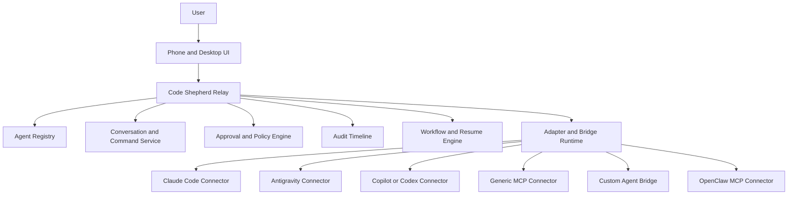

# Code Shepherd — Product Roadmap

**Version:** 3.0  
**Status:** Architecture reset and product refocus  
**Positioning:** Unified control plane for coding agents

> **One place to communicate with, supervise, and coordinate many coding agents.**

Code Shepherd is being repositioned around a clearer product truth:

Developers already use many agent systems across IDEs, terminals, MCP tools, and custom local runtimes. The problem is not the lack of another model. The problem is the lack of one place where all those agents can be seen, messaged, guided, interrupted, and governed.

Code Shepherd should become that place.

---

## 1. Product Thesis

Code Shepherd is a **multi-agent communication and control plane** for:

- IDE-based coding agents such as Claude Code, Antigravity, Codex, Copilot, and Kilo Code
- MCP-capable agents
- custom-built AI agents
- local agents started through scripts, CLIs, or helper runtimes
- OpenClaw integrations exposed through an MCP server path

The product does **not** aim to build a new foundation model or replace existing coding agents.

Instead, it should:

- connect them
- normalize them
- expose them in one interface
- let the user communicate with them from phone or desktop
- preserve approval, audit, and workflow control

---

## 2. The Core Problem

Today, agent work is fragmented across separate tools.

Examples:

- Claude Code may be working in one IDE
- Antigravity may be active in another environment
- OpenClaw or a custom agent may be running locally
- another agent may only expose MCP or CLI control

The user has to jump between tools and machines to:

- check status
- answer questions
- give follow-up instructions
- approve risky actions
- recover blocked sessions

That fragmentation destroys the value of agent parallelism.

### The real gap

The real gap is not only visibility.
It is the lack of a unified layer for:

- presence
- communication
- intervention
- approvals
- audit

---

## 3. Product Goal

Code Shepherd should let a user do this:

1. connect many agents from many tools
2. see which ones are online
3. select one or many agents
4. send instructions or ask questions
5. receive responses in a unified interface
6. approve or reject risky work when needed
7. continue this from desktop or mobile while the source machines remain online

That is the real value proposition.

---

## 4. Product Principles

### 4.1 Not another agent
Code Shepherd is not a replacement for Claude Code, Antigravity, Copilot, Codex, Kilo Code, OpenClaw, or custom agents.

### 4.2 Bridge what already exists
If an agent does not expose the right interface, Code Shepherd should support bridges such as:

- IDE plugins
- local companion apps
- command-installed helpers
- MCP connectors
- monitor-only fallback integrations

### 4.3 The user device is the control plane
The phone or browser should be where the user supervises and interacts with agents.

### 4.4 The source machine must be online
Most connected agents still run on the user's own machine or environment. If that machine is off, the session becomes offline.

### 4.5 Approvals remain essential
Approvals are still core, but they are part of a larger communication system rather than the only product loop.

### 4.6 Multi-agent by default
The system should assume that users may supervise and interact with several agents simultaneously.

---

## 5. The New Killer Loop

```text
Multiple agents connect from IDEs, MCP tools, and local runtimes
       ↓
User sees all agents in one place
       ↓
User opens a thread, sends a command, or asks a question
       ↓
Agent responds, updates status, or requests approval
       ↓
User approves, redirects, or continues the task remotely
       ↓
All actions are logged and the work continues without tool-hopping
```

This loop is stronger than the earlier approval-only framing because it captures daily interaction, not just risky interruptions.

---

## 6. Core Product Surfaces

### 6.1 Inbox
The inbox becomes the front door of the product.

It should allow the user to:

- view active agent conversations
- switch between agents quickly
- see unanswered questions
- spot blocked agents
- reply, redirect, or send new tasks

### 6.2 Agents view
The agents view shows:

- online and offline agents
- adapter type
- capability tier
- last activity
- current task or thread state

### 6.3 Approval queue
Approvals still need a dedicated fast-triage surface.

But each approval should also belong to an agent thread or task context.

### 6.4 Timeline
The timeline remains the auditable history for:

- commands
- replies
- approvals
- state changes
- reconnects
- failures

### 6.5 Tasks
Tasks should evolve into a coordination layer across multiple agents rather than a separate kanban-only feature.

---

## 7. Target Architecture



### Architectural meaning

- **Registry** tracks presence and capability
- **Conversations** handle messages, commands, and replies
- **Approvals** handle risky actions and intervention
- **Audit** preserves evidence across all systems
- **Workflows** preserve state and resumability
- **Bridges** normalize many external agent ecosystems

---

## 8. Capability Tiers

Not every integration will support the same control depth.

| Tier | Meaning | Example |
|---|---|---|
| **Tier 1** | Monitor only | Status, heartbeat, last activity |
| **Tier 2** | Approval capable | Requests approval and receives decision |
| **Tier 3** | Chat capable | User and agent exchange messages |
| **Tier 4** | Full steering | User sends tasks, corrections, and remote instructions |

This tiering is important because it allows the product to support many vendors and custom setups without pretending every connector is equally powerful.

---

## 9. Connection Strategy

Code Shepherd should support four connection patterns:

### 9.1 Native connector
For tools that expose a stable integration surface.

### 9.2 MCP connector
For systems that already support MCP.

### 9.3 Bridge connector
For tools that need:

- a plugin
- a companion process
- a CLI helper
- a local service

### 9.4 Direct session path
For tools where Code Shepherd can attach to the main session directly.

OpenClaw should be treated differently in this repo: it is expected to connect through an MCP server path rather than through a special direct-session assistant runtime.

---

## 10. Data Model Direction

The product should revolve around these entities:

### Agent
- identity
- name
- adapter type
- capability tier
- status
- last heartbeat

### Conversation
- thread between user and one agent or one task context

### Message
- user, agent, or system event inside a conversation

### Command
- structured or freeform instruction sent to an agent

### Approval
- special message or event representing risky-action review

### Task
- work assignment that may involve one or many agents

---

## 11. UX Direction

### Current framing to replace
Old framing:
- dashboard first
- approvals as product center

### New framing
New framing:
- inbox first
- agents second
- approvals embedded but still quickly accessible
- tasks and timeline connected to conversations

The product should feel like a command center, not only an approval dashboard.

---

## 12. Roadmap

## Phase A — Alignment

**Prove:** the product language and data model now match the real goal.

- rewrite architecture and roadmap docs
- define normalized entities and capability tiers
- define bridge and adapter strategy
- define how approvals live inside communication flows

## Phase B — Unified Presence

**Prove:** many agents can appear in one place.

- stable registry
- capability-aware presence model
- offline and reconnect semantics
- first connector onboarding flows

## Phase C — Unified Communication

**Prove:** user can talk to connected agents from one interface.

- inbox
- conversations
- send and receive messages
- one-agent and multi-agent selection
- conversation history

## Phase D — Embedded Intervention

**Prove:** approvals and guidance can happen inside the same control flow.

- approval cards inside threads
- approval queue for triage
- reject with reason
- redirect or revise instruction
- resume workflow from the same interface

## Phase E — Parallel Operations

**Prove:** many agents can be coordinated at once.

- multi-agent tasking
- task ownership and state
- aligned kanban and conversations
- richer timeline and replay

## Phase F — SaaS Hardening

**Prove:** this can support real teams and hosted operations.

- secure bridge registration
- connector permission model
- multi-user governance
- organization audit model
- hosted deployment assumptions

---

## 13. What the current repo already contributes

The current prototype still matters because it already provides:

- relay and persistence foundations
- agent presence foundations
- approval flow foundations
- risk and audit foundations
- mobile-oriented UI foundations
- workflow scaffolding

The product is not being restarted from zero.
It is being **re-centered** around a more valuable use case.

---

## 14. Strategic Positioning

The product should be described as:

> the place where developers connect, communicate with, and govern all of their coding agents.

That is stronger than:

> a mobile approval dashboard for coding agents.

Because the first creates daily utility, while the second only helps during interruptions.

---

## 15. Final Rule for Future Work

Any new feature should be prioritized based on whether it improves one of these four things:

1. unified communication with existing agents
2. remote intervention and approvals
3. simultaneous multi-agent coordination
4. auditability and safe operation

If a task does not clearly strengthen one of these, it is not core roadmap work.
