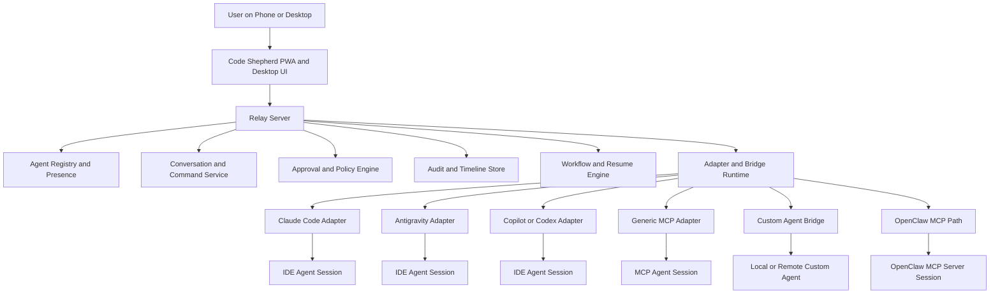

# Architecture: Code Shepherd

## Document Scope

This document separates:

1. **Target Architecture** for the product being built
2. **Current Prototype Reality** in this repository today

That distinction matters because the repo already has useful infrastructure, but the product direction has expanded beyond approvals into unified cross-agent communication.

---

## System Overview

Code Shepherd is a **unified control plane for coding agents**.

It should connect agents from IDEs, local runtimes, MCP servers, bridge processes, and custom systems into one shared experience where a user can:

- discover which agents are online
- message one or many agents
- assign work or give follow-up instructions
- approve risky actions remotely
- inspect live and historical activity
- switch between desktop and phone without losing control

The source machine must remain online for active communication. Code Shepherd is a control plane, not a hosted execution replacement for local agents.

---

## Target Architecture



### Target architectural pillars

#### 1. Unified agent presence
Every connected system should register into a normalized model with:

- agent identity
- adapter type
- connection status
- capability tier
- last heartbeat
- current task or conversation

#### 2. Conversation and command plane
The UI should provide a shared inbox where users can:

- open a thread with any agent
- send commands or natural-language prompts
- receive responses and status updates
- manage many agents simultaneously

#### 3. Adapter and bridge runtime
Because not every agent exposes the same interface, Code Shepherd needs a bridge layer that can support:

- native MCP connections
- IDE-specific plugins or extensions
- local companion daemons
- CLI-installed connectors
- degraded monitor-only integrations when full chat control is not possible

#### 4. Approval and policy engine
Approvals remain essential, but now sit inside a broader conversation flow.

Sensitive actions should still trigger:

- risk scoring
- human approval gates
- rejection reasons
- resume or halt semantics

#### 5. Audit and replay
Every significant event should be traceable:

- registration
- presence change
- messages
- commands
- approvals
- task state changes
- bridge connection issues

#### 6. Workflow and resume layer
Long-running work should survive disconnects where possible through workflow state, resumability, and reconnection semantics.

---

## Connection Model

Code Shepherd should support multiple integration levels instead of assuming every agent is equally controllable.

| Capability Tier | Meaning | Example Outcome |
|---|---|---|
| **Tier 1: Monitor** | Presence and status only | Agent appears online with activity metadata |
| **Tier 2: Approval** | Presence plus approval exchange | Agent can request and receive decisions |
| **Tier 3: Chat** | Bidirectional thread messaging | User can converse with the agent |
| **Tier 4: Steering** | Full task and command control | User can direct ongoing work remotely |

This makes the product realistic across many vendors and custom agent setups.

---

## Current Prototype Architecture

The repository currently implements an **approval-first prototype subset** of the larger vision.

```text
Browser or phone UI
  -> Express relay
  -> agents, approvals, audit, workflows, notifications routes
  -> SQLite persistence
  -> Temporal scaffold
  -> connected agent clients via SDK and direct API calls
```

### Implemented now

- agent registration and heartbeat
- approval creation and decision flow
- approval summaries and diff preview
- audit and timeline endpoints
- realtime event broadcasting foundation
- auth and team scaffolding
- task and operations routes
- agent-side TypeScript SDK for registration, heartbeat, and approvals

### Not implemented yet

- conversation threads and message persistence
- unified inbox UX
- adapter runtime for IDEs and custom bridges
- capability-tier modeling
- one-to-many multi-agent command dispatch
- connector onboarding and installation flows
- fully hardened workflow resume semantics

---

## Core Data Flow in the Target Product

1. An IDE agent, MCP tool, or custom local agent connects through a native integration or bridge
2. Code Shepherd records presence, capability tier, and active session metadata
3. A user opens the inbox and selects one or more agents
4. The user sends a command, follow-up prompt, or operational instruction
5. The relay routes that message through the correct adapter
6. Agent responses stream back into the correct thread or task context
7. If the agent reaches a risky action, an approval request is emitted into both the approval queue and the conversation context
8. The human decision resumes, redirects, or halts the workflow
9. All events are preserved in audit history

---

## Architecture Decisions

| Decision | Choice | Status | Rationale |
|---|---|---|---|
| **Product center** | Unified multi-agent control plane | Updated target | Stronger SaaS position than approvals-only tooling |
| **Primary UX** | Inbox plus approvals plus agent visibility | Target | Communication is first-class, approvals are embedded |
| **Relay model** | Centralized Node.js and Express relay | Active | Normalizes many external agent systems in one place |
| **Bridge strategy** | Adapters plus local helpers plus MCP | Target | Many vendors require custom connection methods |
| **Durable workflow state** | Temporal.io | Partial | Useful for pause, resume, timeout, and disconnected recovery |
| **PWA first** | Progressive Web App | Active | Mobile and desktop reach without app-store dependence |
| **Database path** | SQLite then PostgreSQL | Active plan | Good for local prototyping now, teams later |
| **Security posture** | Policy and approval layered over connectors | Partial | Must govern risky actions across heterogeneous agent systems |

---

## Security Architecture

### Target security model

The platform should treat all connected agents and bridges as semi-trusted integration points.

Security responsibilities include:

- bridge identity and registration control
- capability scoping per adapter
- risk scoring and policy enforcement
- auditability of all user and agent actions
- approval gating for destructive work
- secret-safe connector installation guidance

### Current prototype security reality

Today the repo includes only a subset:

- basic risk scoring
- approval gating
- append-oriented audit logging

These remain future work:

- connector trust model
- scoped bridge credentials
- outbound egress restrictions
- bridge-level permission model
- hardened sandboxing for local execution helpers

---

## UI Architecture Direction

### Target state

The long-term UI should prioritize these surfaces:

- Inbox
- Agents
- Approvals
- Tasks
- Timeline
- Settings

The inbox should become the primary surface because the core job is active communication and intervention across multiple agents.

### Current state

The current UI is centered on:

- Dashboard
- Approval Queue
- Agent Detail
- Timeline
- Kanban
- Settings

This is a strong prototype base, but it still reflects the earlier approval-first framing.

---

## Near-Term Architecture Priorities

1. formalize the adapter and bridge model in shared contracts and docs
2. introduce conversation and message entities before deeper UI work
3. define capability tiers so every integration has a realistic support level
4. embed approvals into conversation-centric flows
5. keep audit and workflow semantics aligned with the new inbox-first product model

---

## Summary

Code Shepherd should be understood as:

- **not** a new model
- **not** a replacement IDE
- **not** a single-agent dashboard

It is a **control plane for many existing agents**, connected through native integrations, bridges, plugins, local helpers, direct sessions where appropriate, and MCP-backed runtimes such as OpenClaw, with unified communication, approvals, and operational visibility.
